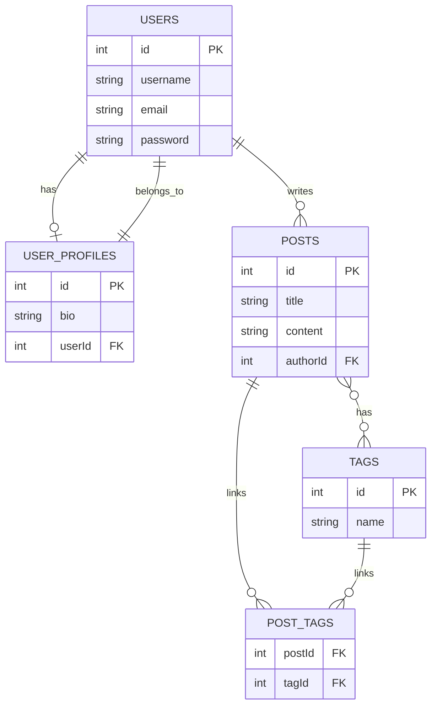

# Database Directory

This directory contains all database migrations and configuration files for the backend.

## Contents

- **migrations/**: TypeORM migration files
- **data-source.ts**: TypeORM CLI configuration (connection, entities, migrations)
- **ormconfig.json**: Alternative CLI config (optional)

## Migration Management

### Common Commands

**Using NPM scripts (recommended):**
- Run all migrations:
  ```bash
  npm run migration:run
  ```
- Generate a new migration:
  ```bash
  npm run migration:generate -- src/database/migrations/YourMigrationName
  ```
- Show migration status:
  ```bash
  npm run migration:show
  ```

**Using TypeORM CLI directly:**
- Generate a new migration:
  ```bash
  npx ts-node ./node_modules/typeorm/cli.js migration:generate src/database/migrations/YourMigrationName -d src/database/migrations/data-source.ts
  ```
- Run migrations:
  ```bash
  npx ts-node ./node_modules/typeorm/cli.js migration:run -d src/database/migrations/data-source.ts
  ```
- Show migration status:
  ```bash
  npx ts-node ./node_modules/typeorm/cli.js migration:show -d src/database/migrations/data-source.ts
  ```
- Revert last migration:
  ```bash
  npx ts-node ./node_modules/typeorm/cli.js migration:revert -d src/database/migrations/data-source.ts
  ```

## Migration Overview

- **1753720126276-InitSchema.ts**: Creates initial tables (`users`, `posts`, `tags`, `post_tags`) with foreign keys and unique constraints.
- **1753720126277-AddUserProfile.ts**: Adds `user_profiles` table (with `bio` field) and sets up a one-to-one relationship with `users`.

**Status:**  
✅ All migrations applied.  
✅ Database schema is current.

## Database Tables

- `users`: User accounts
- `user_profiles`: User profile information (bio)
- `posts`: Blog posts
- `tags`: Unique post tags
- `post_tags`: Many-to-many relationship between posts and tags

## Entity Relationship Diagram (ERD)



---

For more details, see the main backend README.
# End of Selection
