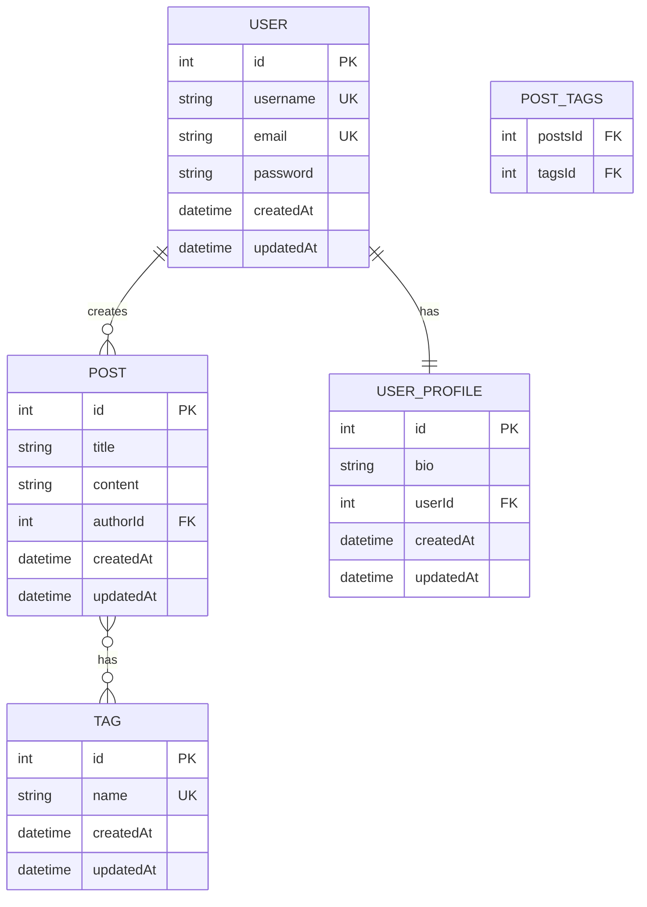

# Database Migrations & Schema

This directory contains TypeORM migration files and database configuration for the Blog Management API.

## 📊 Entity-Relationship Diagram (ERD)



---

## 🗂️ Database Tables

### Users Table
- **Primary Key:** `id` (auto-increment)
- **Unique Constraints:** `username`, `email`
- **Relationships:** 
  - One-to-many with Posts (user creates posts)
  - One-to-one with UserProfile (user has profile)
- **Features:** Password hashing, JWT authentication

### User_Profile Table
- **Primary Key:** `id` (auto-increment)
- **Foreign Key:** `userId` → `users.id` (One-to-one relationship)
- **Fields:** `bio` (nullable text field)
- **Features:** Automatically created during user registration
- **Relationships:** One-to-one with User (profile belongs to user)

### Posts Table
- **Primary Key:** `id` (auto-increment)
- **Foreign Key:** `authorId` → `users.id`
- **Relationships:**
  - Many-to-one with User (post belongs to author)
  - Many-to-many with Tags (post has tags)
- **Features:** Title validation (5-100 characters), ownership enforcement

### Tags Table
- **Primary Key:** `id` (auto-increment)
- **Unique Constraint:** `name`
- **Relationships:** Many-to-many with Posts (tag belongs to posts)
- **Features:** Unique tag names, cascade operations

### Post_Tags Table (Junction)
- **Composite Primary Key:** `postsId`, `tagsId`
- **Foreign Keys:** 
  - `postsId` → `posts.id` (CASCADE DELETE)
  - `tagsId` → `tags.id`
- **Purpose:** Many-to-many relationship between Posts and Tags

---

## 🛠️ Migration Files

### Current Migrations (Applied)
- **1753720126276-InitSchema.ts** - Initial database schema setup
  - Creates all base tables (users, posts, tags, post_tags)
  - Adds foreign key constraints and indexes
  - Sets up unique constraints for username, email, and tag names
  - Configures cascade delete for post-tag relationships

- **1753720126277-AddUserProfile.ts** - Add UserProfile table
  - Creates user_profiles table with bio field
  - Adds One-to-One relationship with User
  - Sets up foreign key constraint and unique index
  - Enables bio functionality for user profiles

### Configuration Files
- **data-source.ts** - TypeORM CLI configuration
  - Database connection settings
  - Entity and migration paths
  - Used by migration commands
  - Explicit entity paths to avoid circular dependency issues

---

## 🚀 Migration Commands

### Generate New Migration
```bash
npx ts-node ./node_modules/typeorm/cli.js migration:generate src/database/migrations/MigrationName -d src/database/migrations/data-source.ts
```

### Run Migrations
```bash
npx ts-node ./node_modules/typeorm/cli.js migration:run -d src/database/migrations/data-source.ts
```

### Show Migration Status
```bash
npx ts-node ./node_modules/typeorm/cli.js migration:show -d src/database/migrations/data-source.ts
```

### Revert Last Migration
```bash
npx ts-node ./node_modules/typeorm/cli.js migration:revert -d src/database/migrations/data-source.ts
```

### NPM Scripts (Recommended)
```bash
# Run migrations
npm run migration:run

# Generate new migration
npm run migration:generate -- src/database/migrations/MigrationName

# Show migration status
npm run migration:show
```

---

## 🔧 Database Configuration

### Connection Settings
- **Type:** MySQL
- **Host:** localhost
- **Port:** 3306
- **Database:** BLOG
- **Username:** root
- **Password:** admin

### Entity Paths
- **Entities:** Explicit paths in data-source.ts to avoid circular dependencies
  - `src/users/entities/user.entity.ts`
  - `src/users/entities/user-profile.entity.ts`
  - `src/posts/entities/post.entity.ts`
  - `src/tags/entities/tag.entity.ts`
- **Migrations:** `src/database/migrations/*.ts`

---

## 💡 Best Practices

### Before Running Migrations
1. **Backup your database** before applying migrations
2. **Test migrations** in development environment first
3. **Review generated SQL** before applying to production
4. **Use meaningful names** for migration files

### Migration Guidelines
- **Never modify** existing migration files after they've been applied
- **Create new migrations** for schema changes
- **Test rollback** functionality before production deployment
- **Document complex changes** in migration comments

### Circular Dependency Handling
- **Use string-based references** for OneToOne relationships
- **Explicit entity paths** in data-source.ts
- **Manual migration creation** when automatic generation fails

---

## 🚨 Important Notes

- **Cascade Delete:** Post-tag relationships are set to CASCADE DELETE
- **Unique Constraints:** Username, email, and tag names must be unique
- **Foreign Keys:** All relationships are properly constrained
- **Timestamps:** All entities include createdAt and updatedAt fields
- **UserProfile:** Automatically created during user registration
- **Bio Field:** Accessible via User entity's computed bio property
- **Circular Dependencies:** Handled with string-based entity references

---
